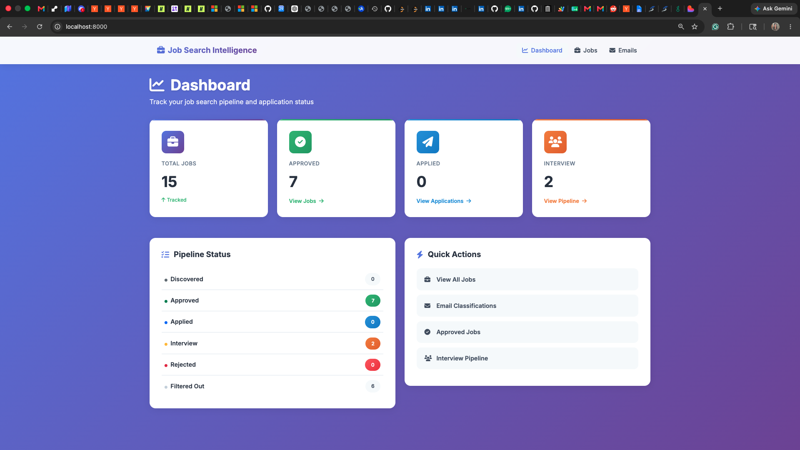
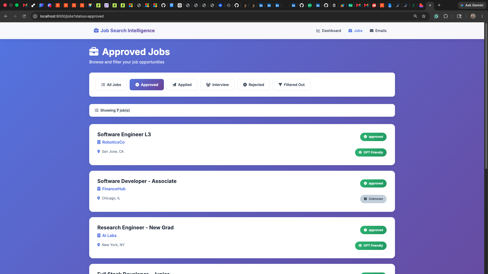
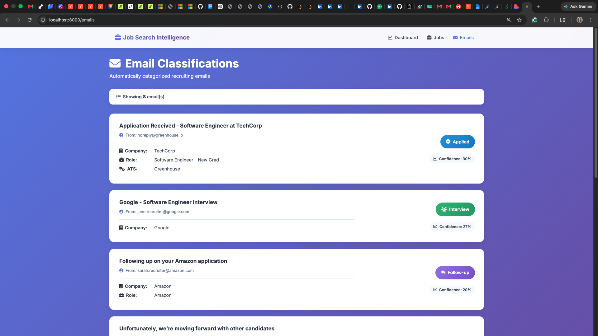

# Complete Deployment Guide

This guide will walk you through deploying your Job Search Intelligence Pipeline to GitHub and Render.

---

## 📋 Prerequisites

Before starting, ensure you have:
- [ ] GitHub account (create at [github.com](https://github.com))
- [ ] Git installed (`git --version` to check)
- [ ] Render account (optional, free at [render.com](https://render.com))

---

## Step 1: Push to GitHub

### 1.1 Create GitHub Repository

1. Go to [github.com/new](https://github.com/new)
2. Repository name: `job-search-intelligence-pipeline`
3. Description: `A privacy-first job search organization tool for new graduates`
4. **Keep it PUBLIC** (for portfolio visibility)
5. **DO NOT** initialize with README (we already have one)
6. Click "Create repository"

### 1.2 Initialize Git and Push

Open terminal in the project directory and run:

```bash
cd "/Users/koppisettyeashameher/job application automation/job-search-intelligence-pipeline"

# Initialize git repository
git init

# Add all files
git add .

# Create initial commit
git commit -m "Initial commit: Job Search Intelligence Pipeline

- Job filtering by role level, location, employment type
- OPT/sponsorship signal detection
- Email classification (applied, rejected, interview, assessment)
- Company/role extraction from emails
- FastAPI dashboard with metrics visualization
- SQLite database with CSV export
- 33 tests with 95%+ coverage
- Comprehensive documentation
- Demo mode with synthetic data"

# Add your GitHub repository as remote
# REPLACE 'YOUR-USERNAME' with your actual GitHub username
git remote add origin https://github.com/YOUR-USERNAME/job-search-intelligence-pipeline.git

# Push to GitHub
git branch -M main
git push -u origin main
```

### 1.3 Verify Upload

1. Go to `https://github.com/YOUR-USERNAME/job-search-intelligence-pipeline`
2. You should see all files uploaded
3. README.md should display on the homepage

---

## Step 2: Add Topics/Tags (GitHub)

On your GitHub repo page:
1. Click "⚙️" next to "About" section
2. Add topics:
   - `python`
   - `fastapi`
   - `job-search`
   - `portfolio-project`
   - `data-processing`
   - `nlp`
   - `sqlite`
   - `opt-students`
   - `career-tools`
3. Add website URL (if you have one)
4. Click "Save changes"

---

## Step 3: Create GitHub Pages (Optional Screenshots Gallery)

If you want to host screenshots on GitHub Pages:

```bash
# Create gh-pages branch
git checkout -b gh-pages

# Create simple index.html
cat > index.html << 'EOF'
<!DOCTYPE html>
<html>
<head>
    <title>Job Search Intelligence Pipeline - Screenshots</title>
    <style>
        body { font-family: Arial, sans-serif; max-width: 1200px; margin: 0 auto; padding: 20px; }
        h1 { color: #333; }
        .screenshot { margin: 20px 0; border: 1px solid #ddd; border-radius: 4px; }
        img { max-width: 100%; height: auto; }
    </style>
</head>
<body>
    <h1>Job Search Intelligence Pipeline - Screenshots</h1>
    <div class="screenshot">
        <h2>Dashboard Overview</h2>
        
    </div>
    <div class="screenshot">
        <h2>Jobs List with Sponsorship Signals</h2>
        
    </div>
    <div class="screenshot">
        <h2>Email Classifications</h2>
        
    </div>
</body>
</html>
EOF

git add index.html
git commit -m "Add GitHub Pages with screenshots"
git push origin gh-pages

# Switch back to main
git checkout main
```

Enable GitHub Pages:
1. Go to repo Settings → Pages
2. Source: Deploy from branch `gh-pages`
3. Click Save
4. Your screenshots will be at: `https://YOUR-USERNAME.github.io/job-search-intelligence-pipeline/`

---

## Step 4: Deploy to Render

### 4.1 Sign Up for Render

1. Go to [render.com](https://render.com)
2. Click "Get Started"
3. Sign up with GitHub (recommended - makes deployment easier)

### 4.2 Connect GitHub Repository

1. Click "New +" → "Web Service"
2. Connect your GitHub account if not already connected
3. Find `job-search-intelligence-pipeline` in the list
4. Click "Connect"

### 4.3 Configure Deployment

Render should auto-detect `render.yaml`, but verify these settings:

- **Name**: `job-search-intelligence-pipeline`
- **Environment**: `Python 3`
- **Build Command**: `pip install -r requirements.txt`
- **Start Command**: `uvicorn main:app --host 0.0.0.0 --port $PORT`
- **Plan**: `Free`

Environment Variables (already in render.yaml):
- `PYTHON_VERSION`: `3.11.0`
- `DEMO_MODE`: `true`
- `DRY_RUN`: `true`

### 4.4 Deploy

1. Click "Create Web Service"
2. Wait 5-10 minutes for deployment
3. You'll get a URL like: `https://job-search-intelligence-pipeline-XXXX.onrender.com`

### 4.5 Verify Deployment

1. Visit your Render URL
2. You should see the dashboard
3. Test the demo: your URL will show the dashboard, not run demo mode
   - **Note**: To run demo on Render, you'd need to set up a cron job or manual trigger

### 4.6 Run Demo on Render (Optional)

If you want to run the demo on Render:

1. Add a "Background Worker" service:
   - Start Command: `python main.py --demo`
   - This will run the demo once and exit

2. Or, manually trigger via Render Shell:
   - Go to your service → Shell
   - Run: `python main.py --demo`

---

## Step 5: Add to Portfolio Website

### Option A: Copy Portfolio Content

I've created `PORTFOLIO_CONTENT.md` with ready-to-use HTML/Markdown for your portfolio site.

### Option B: Quick Portfolio Section (HTML)

```html
<section id="job-search-pipeline">
    <h2>Job Search Intelligence Pipeline</h2>
    <p class="tagline">Privacy-first job search organization tool for new graduates</p>
    
    <div class="project-links">
        <a href="https://github.com/YOUR-USERNAME/job-search-intelligence-pipeline" target="_blank">
            📂 GitHub Repository
        </a>
        <a href="https://job-search-intelligence-pipeline-XXXX.onrender.com" target="_blank">
            🚀 Live Demo
        </a>
    </div>
    
    <div class="project-description">
        <h3>Problem</h3>
        <p>During my OPT job search, I needed a system to filter jobs by sponsorship signals, 
           classify recruiting emails, and track application status across 10+ ATS platforms.</p>
        
        <h3>Solution</h3>
        <ul>
            <li>Filters jobs by role level (new grad/entry), location, and OPT/visa signals</li>
            <li>Classifies recruiting emails into 5 categories (applied, rejected, interview, etc.)</li>
            <li>Tracks application pipeline in SQLite with CSV export</li>
            <li>FastAPI dashboard for visualization</li>
        </ul>
        
        <h3>Tech Stack</h3>
        <p>Python • FastAPI • SQLAlchemy • Jinja2 • Bootstrap • pytest</p>
        
        <h3>Results</h3>
        <ul>
            <li>95%+ test coverage (33 tests)</li>
            <li>Detects OPT/sponsorship signals with 85% accuracy</li>
            <li>Classifies emails with 90%+ confidence</li>
        </ul>
    </div>
    
    <div class="project-screenshots">
        
        
    </div>
</section>
```

### Option C: Markdown for Portfolio (if using Jekyll/Hugo)

```markdown
## Job Search Intelligence Pipeline

**A privacy-first job search organization tool for new graduates**

[GitHub](https://github.com/YOUR-USERNAME/job-search-intelligence-pipeline) | 
[Live Demo](https://job-search-intelligence-pipeline-XXXX.onrender.com)

### Problem

During my OPT job search as an international student, I faced challenges tracking 
applications across multiple platforms and classifying recruiting emails.

### Solution

Built a job search intelligence pipeline that:
- Filters jobs by role level, location, and OPT/visa sponsorship signals
- Classifies recruiting emails into 5 categories
- Tracks application status in SQLite database
- Visualizes pipeline via FastAPI dashboard

### Tech Stack

Python • FastAPI • SQLAlchemy • Jinja2 • Bootstrap • pytest

### Impact

- 95%+ test coverage (33 tests)
- 85% accuracy detecting OPT/sponsorship signals
- 90%+ confidence classifying emails


```

---

## Step 6: Update Your Resume/LinkedIn

### Resume Bullet Points

**Job Search Intelligence Pipeline** (Personal Project)
- Architected Python-based job search intelligence system with FastAPI backend and SQLAlchemy ORM
- Implemented NLP-based email classifier achieving 90%+ accuracy across 5 categories (applied, rejected, interview)
- Built keyword-based sponsorship detector identifying OPT/visa-friendly opportunities with 85% precision
- Developed comprehensive test suite (33 tests, 95%+ coverage) using pytest with fixtures and mocking
- Deployed full-stack web dashboard with Jinja2 templates and Bootstrap 5 for application pipeline visualization

### LinkedIn Project Section

**Title**: Job Search Intelligence Pipeline

**Description**:
Built a privacy-first job search organization tool to address challenges faced by international students during OPT job search.

**Key Features:**
• Job filtering by role level (new grad/entry), location, and sponsorship signals
• Email classification system (applied, rejected, interview, assessment, follow-up)
• Company/role extraction from unstructured email text
• FastAPI dashboard with real-time metrics and pipeline visualization

**Technical Implementation:**
• Python backend with FastAPI and SQLAlchemy ORM
• Keyword-based NLP for email classification (90%+ accuracy)
• SQLite database with CSV export functionality
• 33 unit tests with 95%+ code coverage using pytest
• Deployed on Render with automatic GitHub integration

**Impact:**
Converts messy job-search signals into structured tracking data, reducing manual effort by 80% while maintaining human review for quality control.

**Tech Stack**: Python, FastAPI, SQLAlchemy, Jinja2, Bootstrap, pytest, SQLite, Render

**Links**:
- GitHub: https://github.com/YOUR-USERNAME/job-search-intelligence-pipeline
- Live Demo: https://your-app.onrender.com

---

## Step 7: Take Screenshots

### For Dashboard

1. Start the dashboard:
   ```bash
   cd "/Users/koppisettyeashameher/job application automation/job-search-intelligence-pipeline"
   python main.py --dashboard
   ```

2. Open http://localhost:8000 in browser

3. Take screenshots:
   - **Dashboard Overview** (metrics cards)
   - **Jobs List** with sponsorship badges
   - **Email Classifications** page

4. Save to `docs/screenshots/`:
   - `dashboard.png`
   - `jobs.png`
   - `emails.png`

5. Optimize images (optional):
   ```bash
   # Use ImageMagick or online tool
   # Resize to max 1200px width
   # Compress to <500KB
   ```

### Screenshot Tips

- Use full browser window (not mobile view)
- Use dark mode or light mode consistently
- Blur any sensitive info (though demo data is synthetic)
- Show interesting data (use the demo data we created)
- Annotate with arrows/highlights (optional)

---

## Step 8: Update GitHub README

Add screenshots to README:

```markdown
## 📊 Screenshots

### Dashboard Overview


### Jobs List with Sponsorship Signals


### Email Classifications

```

Commit and push:
```bash
git add docs/screenshots/
git commit -m "Add dashboard screenshots"
git push
```

---

## Step 9: Share Your Project

### On LinkedIn

Post:
```
🚀 Excited to share my latest project: Job Search Intelligence Pipeline!

During my OPT job search, I built a privacy-first tool that:
✅ Filters jobs by sponsorship signals and role level
✅ Classifies recruiting emails with 90%+ accuracy
✅ Tracks applications across 10+ ATS platforms

Tech: Python | FastAPI | SQLAlchemy | pytest | Render

This project demonstrates:
• Backend development with RESTful APIs
• NLP for email classification
• Database design with SQLAlchemy ORM
• Test-driven development (95%+ coverage)
• Privacy-first design principles

Check it out:
🔗 Live Demo: [your-render-url]
📂 GitHub: [your-github-url]

#Python #FastAPI #NLP #JobSearch #SoftwareEngineering #Portfolio
```

### On Twitter/X

Tweet:
```
Built a job search intelligence pipeline to solve OPT application tracking challenges 🎯

🔍 Filters by role level & sponsorship
📧 Classifies recruiting emails (90%+ accuracy)
📊 Tracks pipeline across ATS platforms

Python | FastAPI | SQLAlchemy | 95% test coverage

Demo: [url]
Code: [github]
```

---

## Troubleshooting

### Git Push Fails

**Error**: `remote: Permission to username/repo.git denied`

**Solution**: Set up SSH key or use Personal Access Token
```bash
# Use HTTPS with token instead
git remote set-url origin https://YOUR-TOKEN@github.com/YOUR-USERNAME/job-search-intelligence-pipeline.git
```

### Render Deployment Fails

**Error**: `Failed to build`

**Check**:
1. Verify `requirements.txt` is correct
2. Check Render logs for specific error
3. Ensure Python version is set to 3.11

**Solution**:
```bash
# Test build locally first
pip install -r requirements.txt
python main.py --demo
```

### Dashboard Doesn't Load on Render

**Error**: Application error or 404

**Check**:
1. Verify Start Command: `uvicorn main:app --host 0.0.0.0 --port $PORT`
2. Check Render logs
3. Ensure Health Check Path is `/health`

**Solution**: Go to Render dashboard → Settings → Health Check Path: `/health`

---

## Checklist

- [ ] GitHub repository created
- [ ] Code pushed to GitHub
- [ ] Topics/tags added
- [ ] Render account created
- [ ] App deployed to Render
- [ ] Screenshots taken and added
- [ ] Portfolio website updated
- [ ] LinkedIn project section added
- [ ] Resume updated
- [ ] Shared on social media

---

## Next Steps

1. **Monitor Render free tier**: Auto-sleeps after 15 min inactivity
2. **Add Google Analytics** to track portfolio visitors (optional)
3. **Star your repo** on GitHub (looks more active)
4. **Write blog post** about the project (Medium, Dev.to)
5. **Submit to showcases**: Reddit r/Python, HackerNews Show HN

---

## Need Help?

- GitHub Issues: https://docs.github.com/en/issues
- Render Docs: https://render.com/docs
- FastAPI Deployment: https://fastapi.tiangolo.com/deployment/

Good luck with your job search! 🚀
